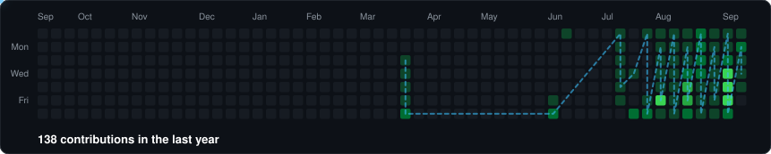
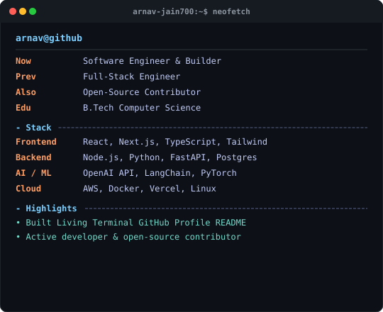
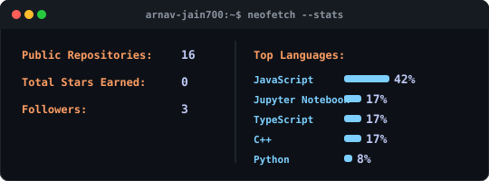

  <!-- Dynamic Typing Header -->
  

   

  <!-- Interactive Badges & Profile Visitor Counter -->
  

    
    &nbsp;
    
    &nbsp;
    
    &nbsp;
    
  

   

  <!-- Living Contribution Graph & Snake Game with Month Headers & Hover Tooltips -->
  <h3><code>arnav-jain700@github ~ $ git log --contributions --snake</code></h3>
  

    

  <!-- Terminal System Info Panel (whoami) -->
  <h3><code>arnav-jain700@github ~ $ whoami</code></h3>
  

    
  

   

  <!-- Self-Contained Terminal Stats & Languages Showcase -->
  <h3><code>arnav-jain700@github ~ $ neofetch --stats</code></h3>
  

    
  

   

  <!-- Tech Stack Grid -->
  <h3><code>arnav-jain700@github ~ $ cat stack.json</code></h3>

  <table>
    <tr>
      <td align="center" width="120"><b>Frontend</b></td>
      <td>
        
        
        
        
        
        
        
      </td>
    </tr>
    <tr>
      <td align="center" width="120"><b>Backend</b></td>
      <td>
        
        
        
        
        
        
        
      </td>
    </tr>
    <tr>
      <td align="center" width="120"><b>AI & Data</b></td>
      <td>
        
        
        
        
        
        
      </td>
    </tr>
    <tr>
      <td align="center" width="120"><b>DevOps & Cloud</b></td>
      <td>
        
        
        
        
        
        
      </td>
    </tr>
  </table>

    

  <!-- Recent GitHub Activity Feed -->
  

    <h3><code>⚡ Recent GitHub Activity</code></h3>

<!--START_SECTION:activity-->
- 🚀 Created branch `main` in [arnav-jain700/arnav-jain700](https://github.com/arnav-jain700/arnav-jain700)
- 🚀 Created branch `main` in [arnav-jain700/Autism-Spectrum-Diagnosis](https://github.com/arnav-jain700/Autism-Spectrum-Diagnosis)
- ⭐ Starred repository [codecrafters-io/build-your-own-x](https://github.com/codecrafters-io/build-your-own-x)
- ⭐ Starred repository [practical-tutorials/project-based-learning](https://github.com/practical-tutorials/project-based-learning)
- ⭐ Starred repository [Asabeneh/30-Days-Of-Python](https://github.com/Asabeneh/30-Days-Of-Python)
<!--END_SECTION:activity-->

  

    

  <!-- Footer Banner -->
  

    <i>"Code is like humor. When you have to explain it, it’s bad."</i>
      
    
  

